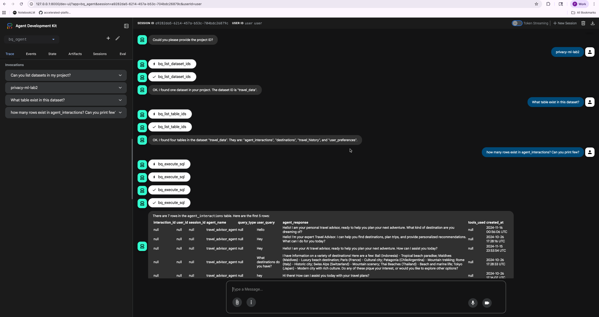

# BigQuery MCP OAuth Demo

Python client demonstrating OAuth 2.0 authentication for Google's BigQuery MCP server using HTTP transport.



## Overview

This demo implements a Model Context Protocol (MCP) client that authenticates with Google BigQuery using OAuth 2.0. The client connects to BigQuery's MCP server via HTTP transport and can list tools and execute SQL queries.

## Prerequisites

- Python 3.11+
- Conda (recommended)
- Google Cloud OAuth credentials (client_secret JSON file)
- Access to a BigQuery project

## Setup

> **⚠️ IMPORTANT: Enable BigQuery MCP API**
>
> Before running the demo, you must enable BigQuery MCP access for your project:
> ```bash
> gcloud beta services mcp enable bigquery.googleapis.com --project=YOUR_PROJECT_ID
> ```
> Replace `YOUR_PROJECT_ID` with your actual GCP project ID. Wait a few minutes after running this command for the changes to propagate.

1. Create and activate conda environment:
```bash
conda env create -f environment.yml
conda activate bigquery-mcp-oauth
```

2. Install MCP SDK:
```bash
pip install mcp --index-url https://pypi.org/simple
```

3. Place your OAuth client secret file in the project directory

## Usage

Run the demo:
```bash
python demo.py
```

The script will:
1. Check for cached OAuth credentials in `token.json`
2. Launch browser for authentication if needed
3. Request necessary BigQuery scopes:
   - `https://www.googleapis.com/auth/bigquery`
   - `https://www.googleapis.com/auth/bigquery.readonly`
   - `https://www.googleapis.com/auth/cloud-platform`
4. Connect to BigQuery MCP server via HTTP
5. List available MCP tools
6. Query the specified BigQuery table using `execute_sql` tool
7. Display results

## Configuration

Edit `demo.py` to modify:
- `project_id`: Your GCP project ID
- `table_id`: BigQuery table to query (format: `project.dataset.table`)

## MCP Server Configuration

**Server Details:**
- Server name: BigQuery MCP server
- Server URL: bigquery.googleapis.com/mcp
- Transport: HTTP
- Protocol Version: 2024-11-05

## Architecture

### Components

**oauth_handler.py**
- Manages OAuth 2.0 flow using `google-auth-oauthlib`
- Handles token refresh and persistence
- Implements local callback server for authorization code

**mcp_client.py**
- BigQuery MCP client implementation
- Uses HTTP transport for MCP communication
- Implements JSON-RPC 2.0 protocol
- Provides query interface with automatic authentication

**demo.py**
- Main entry point
- Orchestrates OAuth flow and BigQuery queries
- Configured for `privacy-ml-lab2.travel_data.agent_interactions` table

## MCP Tools Available

The BigQuery MCP server provides the following tools:

1. **list_dataset_ids** - List BigQuery dataset ids in a Google Cloud project

2. **get_dataset_info** - Get metadata information about a BigQuery dataset

3. **list_table_ids** - List table ids in a BigQuery dataset

4. **get_table_info** - Get metadata information about a BigQuery table

5. **execute_sql** - Run a BigQuery SQL query in the project and return the result
   - Restricted to SELECT statements only
   - No insert/update/delete statements or stored procedures allowed
   - Supports BigQuery ML operations (ML.EVALUATE, ML.PREDICT, AI.FORECAST)
   - All queries labeled with "goog-mcp-server: true"

## Example Connection Output

```
Connecting to BigQuery MCP server at https://bigquery.googleapis.com/mcp...
Connected to BigQuery MCP server
Response: {
  'id': 1,
  'jsonrpc': '2.0',
  'result': {
    'capabilities': {'tools': {'listChanged': False}},
    'protocolVersion': '2024-11-05',
    'serverInfo': {'name': 'StatelessServer', 'version': 'ESF'}
  }
}

Available tools:
  - list_dataset_ids: List BigQuery dataset ids in a Google Cloud project
  - get_dataset_info: Get metadata information about a BigQuery dataset
  - list_table_ids: List table ids in a BigQuery dataset
  - get_table_info: Get metadata information about a BigQuery table
  - execute_sql: Run a BigQuery SQL query in the project and return the result...
```

## Implementation Details

### HTTP Transport

The client uses HTTP transport for MCP communication:
- JSON-RPC 2.0 protocol over HTTPS
- OAuth Bearer token authentication
- POST requests to `https://bigquery.googleapis.com/mcp`

### MCP Methods Used

**Initialize Connection:**
```json
{
  "jsonrpc": "2.0",
  "id": 1,
  "method": "initialize",
  "params": {
    "protocolVersion": "2024-11-05",
    "capabilities": {},
    "clientInfo": {
      "name": "bigquery-mcp-client",
      "version": "1.0.0"
    }
  }
}
```

**List Tools:**
```json
{
  "jsonrpc": "2.0",
  "id": 2,
  "method": "tools/list",
  "params": {}
}
```

**Execute SQL:**
```json
{
  "jsonrpc": "2.0",
  "id": 3,
  "method": "tools/call",
  "params": {
    "name": "execute_sql",
    "arguments": {
      "query": "SELECT * FROM `project.dataset.table` LIMIT 10",
      "projectId": "your-project-id"
    }
  }
}
```

## Notes

- OAuth tokens are cached in `token.json` for reuse
- Token refresh happens automatically when expired
- MCP server connection successful via HTTP transport
- Successfully lists all 5 available MCP tools
- Query execution requires valid OAuth scopes and permissions

## Troubleshooting

**403 Forbidden - "BigQuery API has not been used in project before or it is disabled via MCP policy":**
- **Solution:** Enable BigQuery MCP API for your project:
  ```bash
  gcloud beta services mcp enable bigquery.googleapis.com --project=YOUR_PROJECT_ID
  ```
- Wait a few minutes after enabling for changes to propagate

**403 Forbidden on query execution:**
- Ensure OAuth token hasn't expired (delete `token.json` and re-authenticate)
- Verify all required BigQuery scopes are granted
- Check project permissions in Google Cloud Console

**Connection timeout:**
- Verify network connectivity to googleapis.com
- Check firewall settings

## Dependencies

See `requirements.txt` and `environment.yml` for complete list:
- google-auth-oauthlib >= 1.2.0
- google-auth >= 2.23.0
- mcp >= 1.0.0
- httpx >= 0.25.0

## License

MIT
